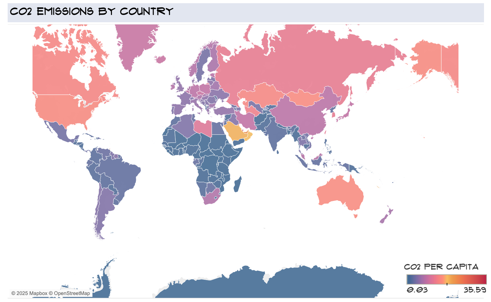
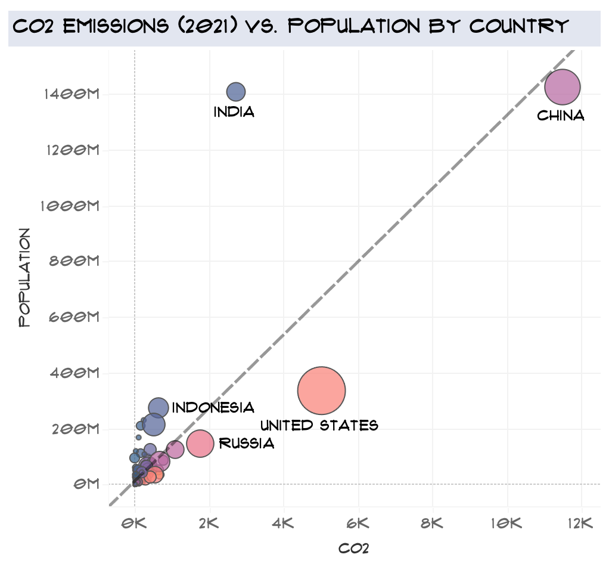

# 🌍 Global CO2 Emissions
This project analyzes **Global CO2 Emissions** to extract valuable insights through visualization.    
The goal is to identify which regions are the primary contributors to carbon emissions and understand their impact over the last 250 years.  
 

🚀 **Project Overwiev**  
This project is part of a guided course from [Maven Analytics](https://www.mavenanalytics.io/).  
The dataset and project structure were provided, but all **data preparation, analysis, and visualization were completed by me**.

## ✅ What I Learned
- Profiling and quality assurance of data
- Preparing data for visualization
- Visualizing data and summarizing key findings

🛠️ ## Technologies Used:
Tableau

## 🔎 How to Use The Dashboard

To explore the analysis, open the following file:

👉 **Click to view the Tableau Dashboard:**  
🔗 [View Tableau Dashboard](https://public.tableau.com/app/profile/oga.buriakova/viz/CO2Emissions_17400307514980/Dashboard1?publish=yes)  
(Recommended to open in a new tab)  
- Click on a country within the map to filter all charts by that selection
- Use the dropdown filter in the top-right corner to view data by country
- To reset the view, click outside of the selected country or clear the filter

## 🔥 Key Insights
### 🔹 CO2 emissions differ by country 
CO2 emissions per capita are **very low in Africa and South America**,  
in contrast to **higher levels in Asia, North America, and Europe.**

### 🔹 CO2 emissions and Population
**China** is rising in CO2 emissions, increasing in proportion to its growing population.   
**India's** population is increasing faster than its CO2 contribution.    
**The United States** emits a disproportionately high amount of CO2 compared to its population size.

### :bulb: Conclusion 
This dashboard can support policymakers and researchers in:
- Identifying regions with the highest impact on global emissions
- Assessing the effectiveness of emission reduction strategies over time
- Prioritizing efforts for future sustainability initiatives
